# Raspberry-Pi
Documentation about the Raspberry Pi 5

# Table Of Content
- [Info](##Info)


## Info
Here is the name of the tool I used to format my windows disk to ext4
[MiniTool Partition Wizard](https://www.partitionwizard.com/free-partition-manager.html)

## Crashing stats
### First crash:
My Pi crashed once on 29.3.2025 <br>
Root-cause: SD-card, system crashed while updating <br>
How-to-fix: I downloaded Archlinux on my USB-Drive, so that I can check my SD-card and fix it with Linux tools.

### Second crash:
Not yet, and hopefully, it doesn’t crash again! <br>


## Security
I installed a new service. This helps to prevent brute-force-attacks. For further details add a comment.


## Photos
All 17 Photos are in the folder "photos".


# How to Connect to a Raspberry Pi 5 Without a Mini HDMI and Still Get a Display
First, place your Raspberry Pi 5 into the Argon NEO 5 Case for better airflow and cooling.

Next, take your microSD card, install your preferred Raspberry Pi OS from the official website, and format the card if necessary.

After that, connect your power supply (via the USB-C port) and insert the microSD card into the Raspberry Pi.

After a few seconds, the Pi should boot up completely.

Now, scan your network to confirm that the Raspberry Pi is working correctly. I used Angry IP Scanner for this.
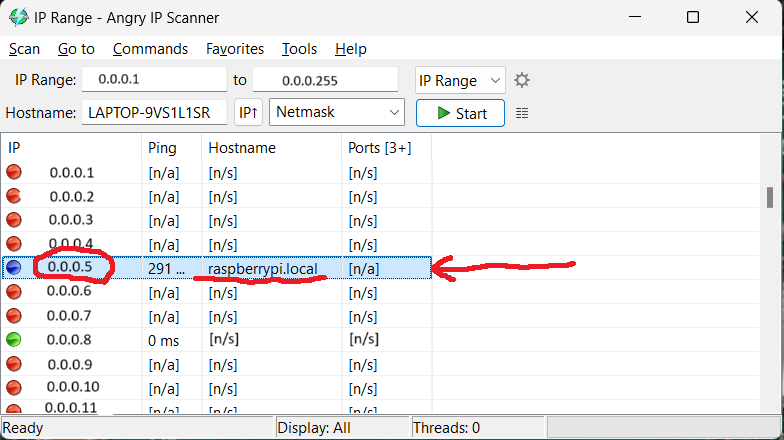

In this application, search for the hostname "raspberrypi.local"—this will be your Raspberry Pi. The corresponding IP address of the Pi will also be displayed there.

Next, open PuTTY and connect to your Raspberry Pi using the IP address you found in the IP scan.
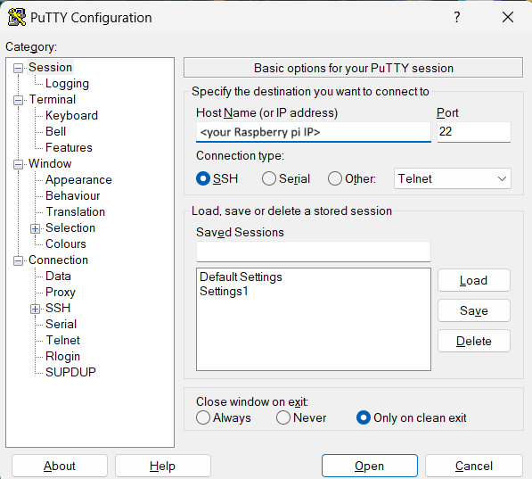
<br>
Once connected, enter the following command:

```bash
sudo raspi-config
```
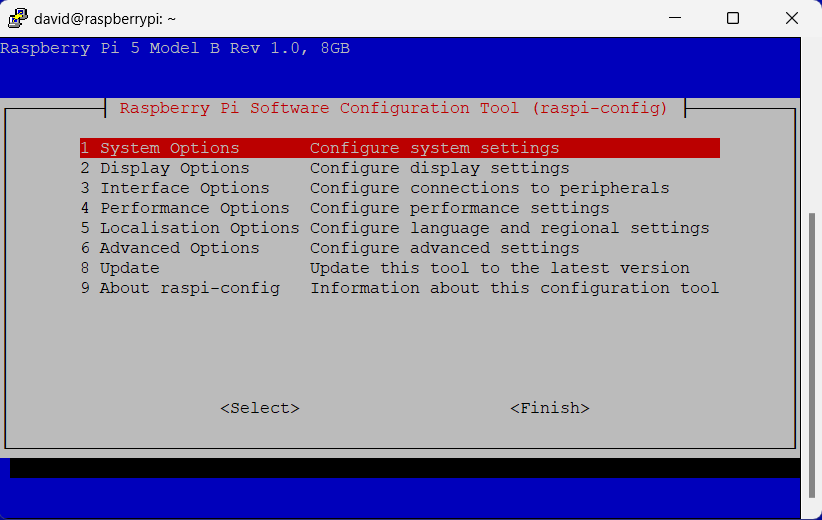

Go to "Advanced Options" (Option 6) and select "Display Options" (Option 2).
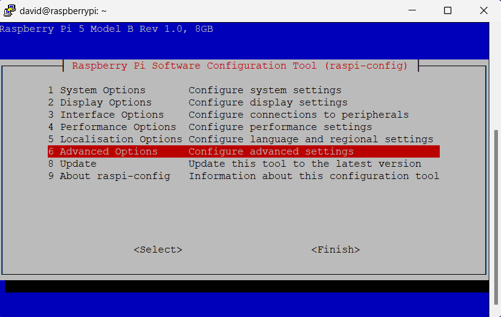
<br>
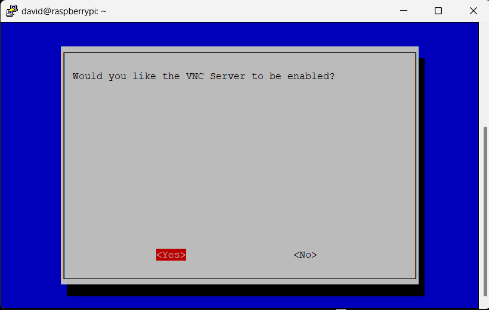
<br>
Reboot your Raspberry Pi.
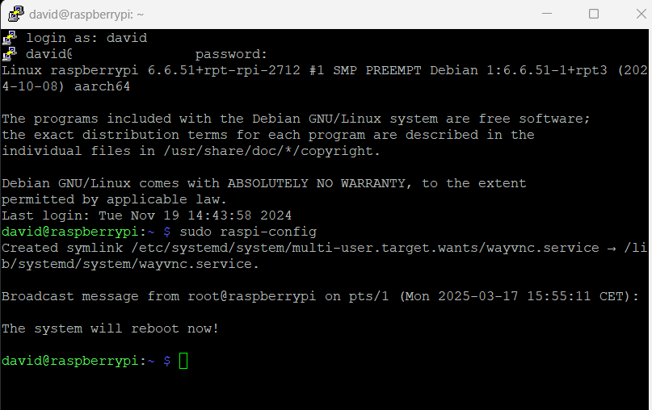
<br>
Now, you can use VNC Viewer to connect to your Raspberry Pi 5.
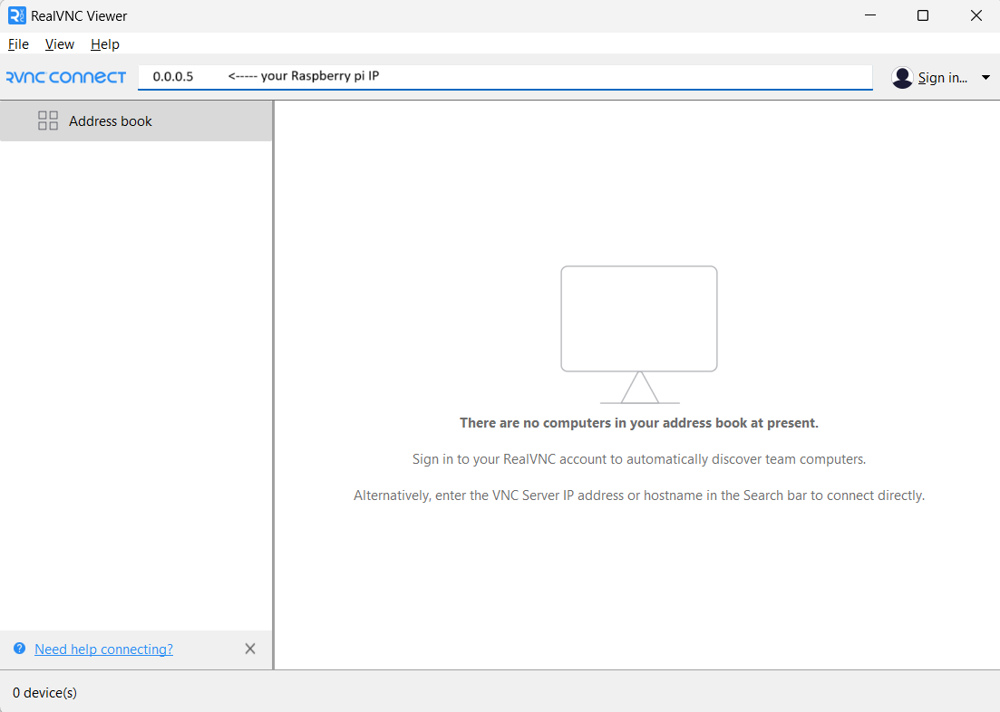
<br>
Enter the IP address of the Pi and click Connect.

After a short while, you should see the Raspberry Pi’s desktop on your screen.
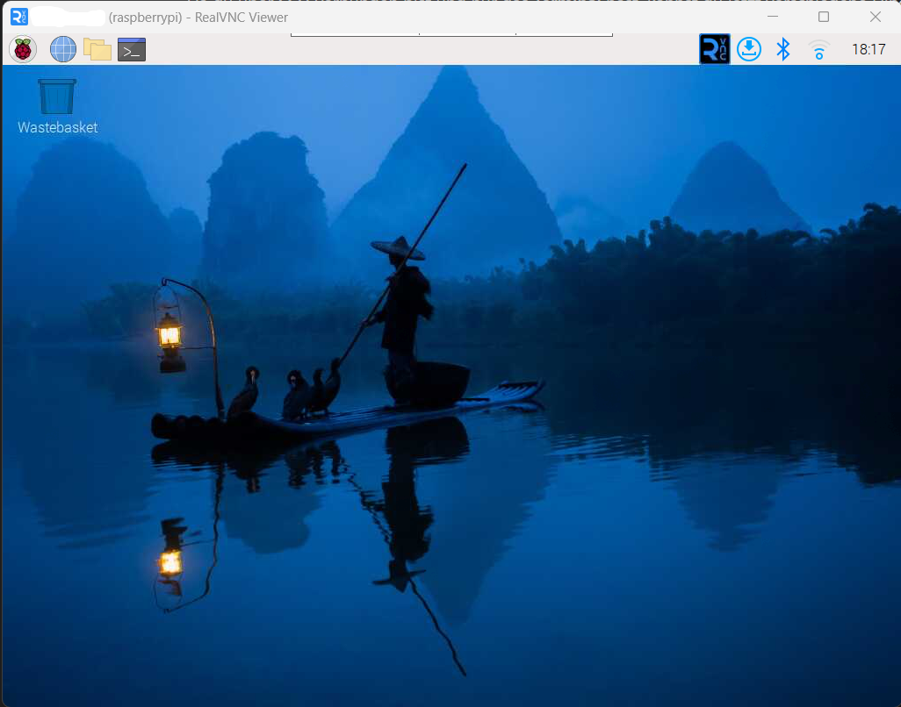

Congratulations! Your Raspberry Pi is now set up for remote access!

---

# Raspberry Pi 5 – Hosting a Website with Cloudflare Tunnel

### How to build a website on a Raspberry Pi 5

## 1. Installing Apache and Setting up a Web Server

To host a website, install Apache on the Raspberry Pi:
```bash
sudo apt update
sudo apt install apache2 -y
```

Once installed, the default web root is:
```
/var/www/html
```

You can access the default Apache page by opening a browser and going to:
```
http://<Your-Raspberry-Pi-IP>
```

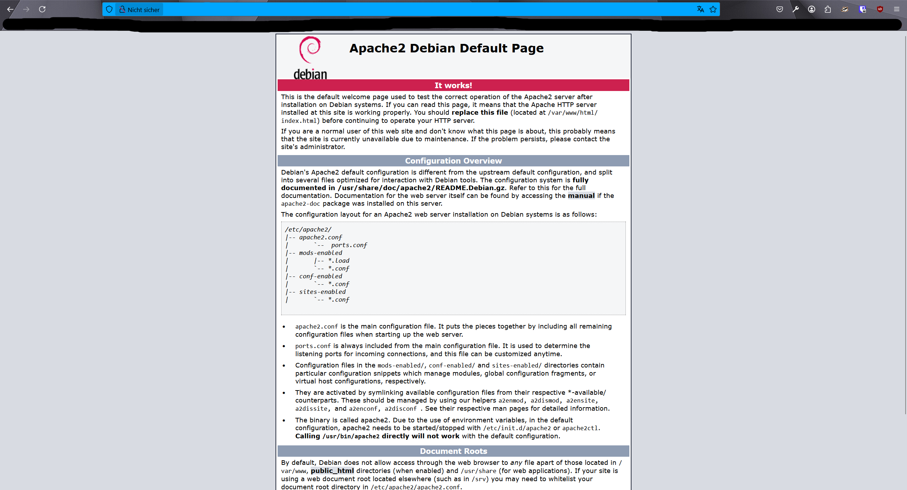

## 2. Setting up Cloudflare and a Custom Domain

### Step 1: Purchase a Domain
- Use your prefered Website for buying a domain.
- I used Swizzonic to purchase the domain `koteski.ch`.


### Step 2: Configure Cloudflare
- Register at Cloudflare.
- Add the domain to Cloudflare.
- Change the Nameservers in Swizzonic to:
  - `yournameserver1.ns.cloudflare.com`
  - `yournameserver2.ns.cloudflare.com`

### Step 3: Install Cloudflare Tunnel

On your Raspberry Pi, install cloudflared:
```bash
sudo apt install cloudflared
```

Authenticate with Cloudflare:
```bash
cloudflared tunnel login
```

Create a new tunnel:
```bash
cloudflared tunnel create raspberrypi-home
```

Save the tunnel credentials to:
```
/home/pi/.cloudflared/cert.pem
```

Check if the tunnel is available:
```bash
cloudflared tunnel list
```

Start the tunnel:
```bash
cloudflared tunnel run raspberrypi-home
```

## 3. Configuring DNS Records in Cloudflare

To make the website available at `www.koteski.ch` and `koteski.ch`, add the following records:
| Type  | Name       | Content                       |
|-------|------------|-------------------------------|
| CNAME | www        | Tunnel ID (from Cloudflare)   |
| A     | koteski.ch | 192.0.2.1 (Cloudflare Dummy IP) |

Enable the following settings in Cloudflare:
- Always Use HTTPS
- Proxy Mode (Proxied)
- Universal SSL

## 4. Testing and Troubleshooting

### Verify DNS propagation:
```bash
nslookup koteski.ch
```

### Check Cloudflare tunnel status:
```bash
cloudflared tunnel list
```

### Restart services:
```bash
sudo systemctl restart apache2
sudo systemctl restart cloudflared
```

### Test website connectivity:
```bash
curl -I https://koteski.ch
```

---

Now the website `www.koteski.ch` should be accessible via the Cloudflare Tunnel.
Test it out!


# PiAnywhere
Want to fully control your Raspberry Pi from anywhere? Here's how:

Install [WireGuard](https://www.wireguard.com/install/)

Tutorial soon coming!


# Nextcloud


It works!


# Final setup

Here are all the things that came with my delivery
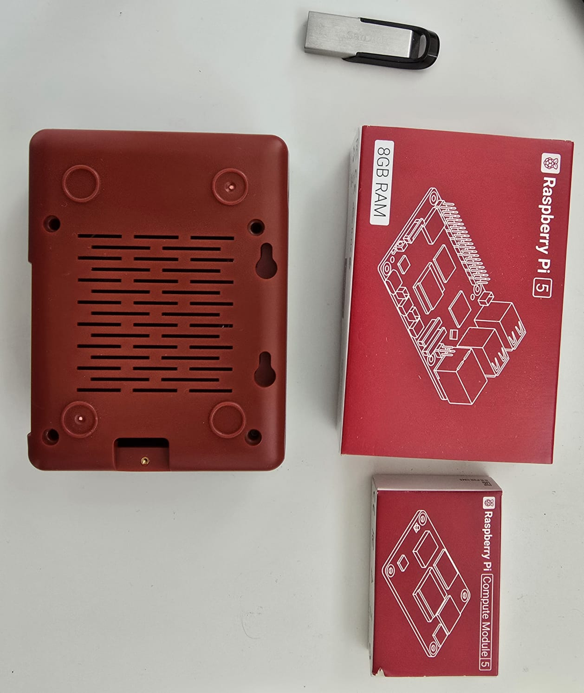

This is the base Raspberry Pi 5
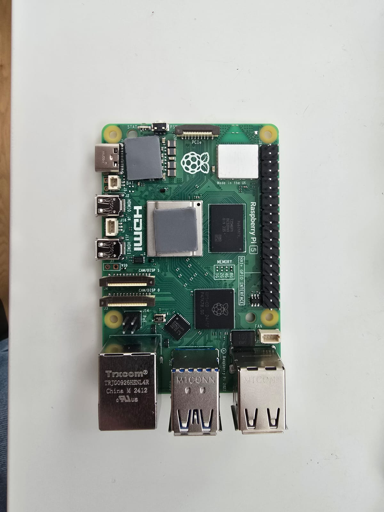

This is the Raspberry Pi 5 with the Argon Case fully assembled
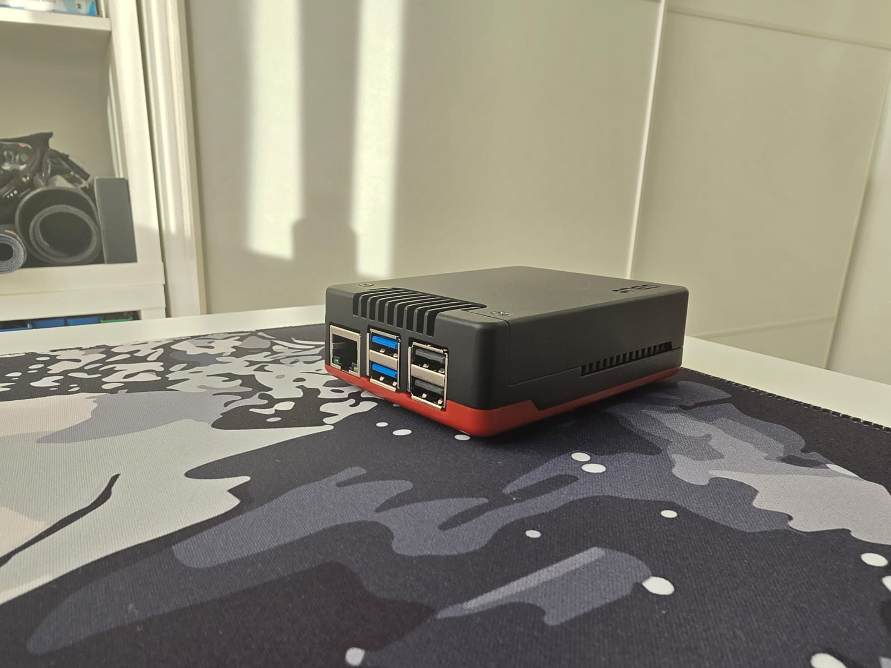

And this is what it looks like while being connected and hosting the website
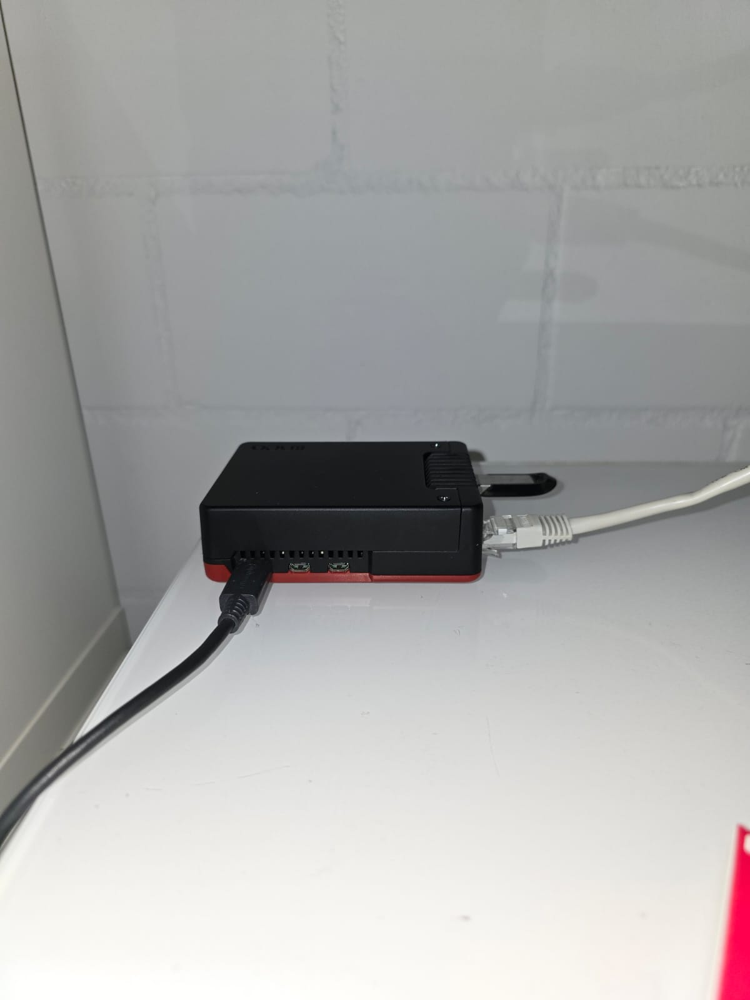
